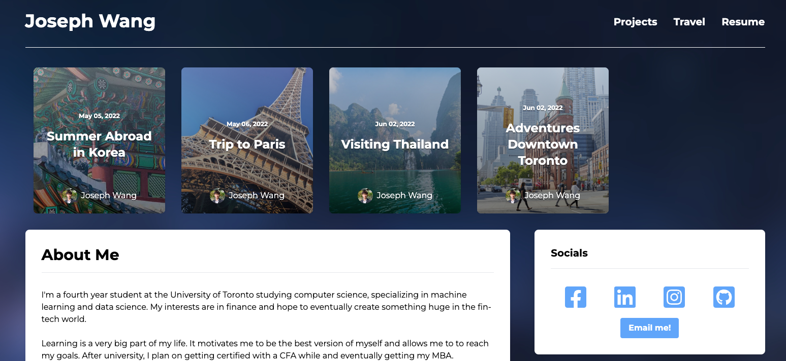

# Blog App



Blog App is a personal blog and ePortfolio built with **NextJS, TailwindCSS and GraphQL**.

All content is dynamically hosted on **GraphCMS**.

Please check out the live site deployed on **Vercel** below!

[Live Site](https://blog-app-josephhlwang.vercel.app)

## Run It Locally

### 1. Clone Repo

```sh
git clone https://github.com/josephhlwang/blog_app.git
```

### 2. Install Packages

```sh
npm install
```

### 3. Add Environment Variables

Create a GraphCMS account and add your `NEXT_PUBLIC_GRAPHCMS_ENDPOINT` and `GRAPHCMS_TOKEN` tokens in the `.env` file.

### 4. Start App

```sh
npm run dev
```
